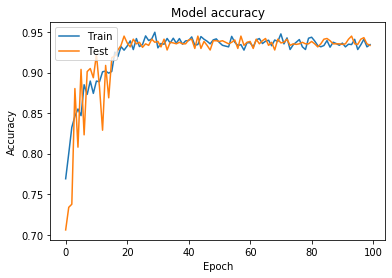

# Weather-image-classification

I have built an image classifier using Deep learning & Convolutional Neural Network to predict the type of weather given an input image.

## Dataset
Link : https://data.mendeley.com/datasets/4drtyfjtfy/1  
Multi class weather dataset contains different images of weather.
There are four classes :
<li>Cloudy</li>
<li>Rain</li>
<li>Shine</li>
<li>Sunrise</li>

## Notebook

The notebok contains CNN classifier for the task built from scratch.

### Accuracy Graph

### CNN Architecture

